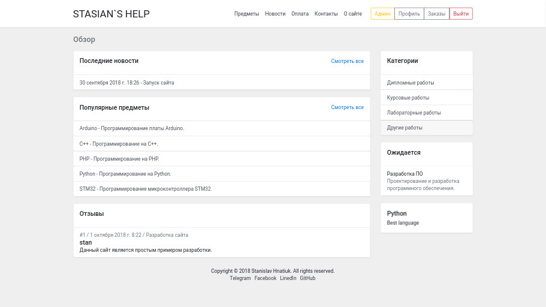

# STASIAN`S HELP

## Introdution

This project is a platform for placing orders for the work of students.
The project is designed to explore the capabilities of the Django framework and acquire practical skills.

[stasianshelp.herokuapp.com](https://stasianshelp.herokuapp.com/)




## Installing

1. Create a Python 3.7 virtualenv;
2. Install dependencies:

`$ pip install -r requirements.txt`

3. Create settings file (development.py, test.py and production.py) in settings module;
4. Create tables:

`$ python manage.py migrate`

5. Create superuser:

`$ python manage.py createsuperuser`


### Development

Create the development.py settings file with the following defined variables:

```
from .base import *

SECRET_KEY = <complex and long secret key>
EMAIL_HOST = <example 'smtp.gmail.com'>
EMAIL_HOST_USER = <your username>
EMAIL_HOST_PASSWORD = <your password>
DEFAULT_FROM_EMAIL = <your email>
```

To start the development server:

    $ python3 manage.py runserver --settings=stasians_help.settings.development",


### Testing

Create the test.py settings file with the following defined variables:

```
from .development import *

TEST_USERNAME = <admin username for tests>
TEST_PASSWORD = <admin password for tests>
```

To running all tests:

`$ python3 manage.py test --settings=stasians_help.settings.test"`


### Deployment

Create the development.py configuration file with the following declared variables:

```
from .base import *

SECRET_KEY = <complex and long secret key>
EMAIL_HOST = <example 'smtp.gmail.com'>
EMAIL_HOST_USER = <your username>
EMAIL_HOST_PASSWORD = <your password>
DEFAULT_FROM_EMAIL = <your email>

DEBUG = False

ALLOWED_HOSTS = ['<your host>']
```


## Built with

- [Python 3.7](https://docs.python.org/3/) - The programming language used;
- [Django 2.1](https://docs.djangoproject.com/en/2.1/) - The web framework used;
- [Bootstrap 4](https://getbootstrap.com/docs/4.1/getting-started/introduction/) - The front-end component library used.


## License

This project is licensed under the MIT License - see the [LICENSE](LICENSE) file for details.
